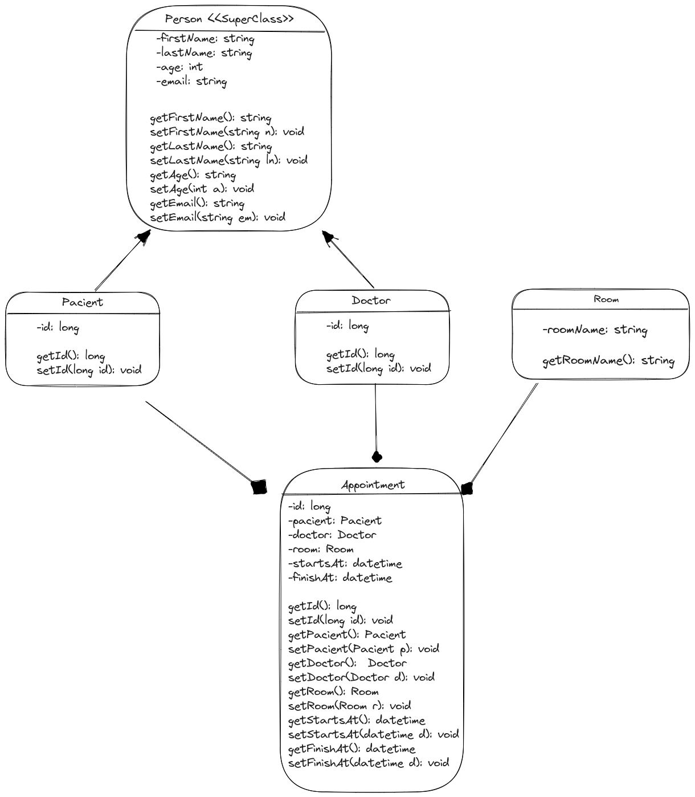

# Java Back End Developer challenge

Este proyecto es un desafío llevado a cabo por **nuwe.io** en colaboración con **Accenture tech hub**. Siendo el
objetivo principal implementar, solucionar y desarrollar las diversas necesidades de un hospital en cuanto a la gestión
de citas.

El proyecto está compuesto por 3 capas:

* **Controllers:** Esta capa contiene los endpoints y, en este caso, la lógica de negocio.
* **Entities:** En esta capa se encuentran las representaciones de las entidades con las que trabaja la base de datos.
* **Repositories:** En esta capa se encuentra la lógica para realizar operaciones (CRUD) en la base de datos.

Estas capas trabajan en conjunto para facilitar la gestión de citas en el hospital.

El objetivo principal de este proyecto es facilitar el proceso de creación de citas para un hospital. Es por esto que se
presentan varios endpoints (URIs) a través de los cuales se pueden realizar diversas operaciones que trabajan en
conjunto con las capas mencionadas anteriormente. A continuación, se enumeran algunos de los principales endpoints
utilizados en el proyecto:
El URL base APIREST es:
```http://172.17.0.3:8080/api```

| metodo |       ruta       |                          descripcion                           |
|:------:|:----------------:|:--------------------------------------------------------------:|
|  post  |   /appoinment    | Crea una cita a partir del doctor, el paciente y la habitacion |
|  get   | /appoinment/{id} |                Busca una cita a partir de su ID                |
| delete | /appoinment/{id} |                Borra una cita a partir de su ID                |
|  get   |     /doctor      |                   Obtiene todos los doctores                   |
|  get   |      /rooms      |                 Obtiene todas las habitaciones                 |

Estos son algunos de los métodos disponibles que se pueden utilizar.

A continuación se ilustra un diagrama en UML que muestra cómo están relacionadas las entidades:

